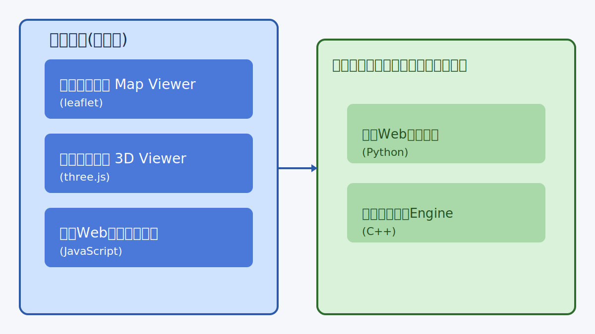
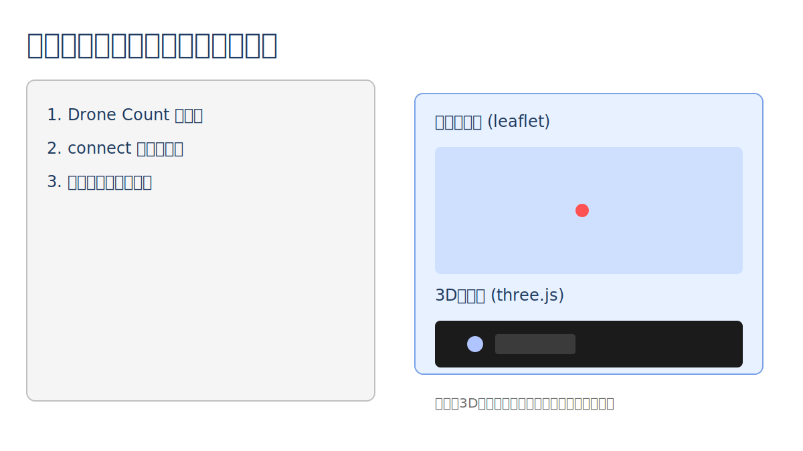

# 箱庭ドローン Map Viewer

箱庭ドローンシミュレータと連携し、ブラウザ上でドローンの移動状況をリアルタイムに可視化するビューアです。

## 想定ユーザー

* 箱庭ドローンのリアルタイム監視用ブラウザの利用者

## 前提条件

* 箱庭ドローンシミュレータがインストール済みであること

## 動作環境

* Webブラウザがあれば利用できます

## 利用技術

* **three.js**: 3Dビューでのドローン表示
* **leaflet**: オープンストリートマップ上でのドローン移動表示

## アーキテクチャ概要

本ビューアは、箱庭シミュレーション環境のうち「ブラウザ側」の可視化コンポーネントに相当します。

* 箱庭ドローン Map Viewer (leaflet)
* 箱庭ドローン 3D Viewer (three.js)
* 箱庭Webクライアント (JavaScript)

## 使い方

1. 箱庭ドローンシミュレーションを起動します。
2. ブラウザで次のURLにアクセスします。
   * `http://localhost:8001/src/client/index.html`
3. 画面内の **Drone Count** でドローン数を選択します。
4. **connect** をクリックすると、ドローンの状態が可視化されます。

